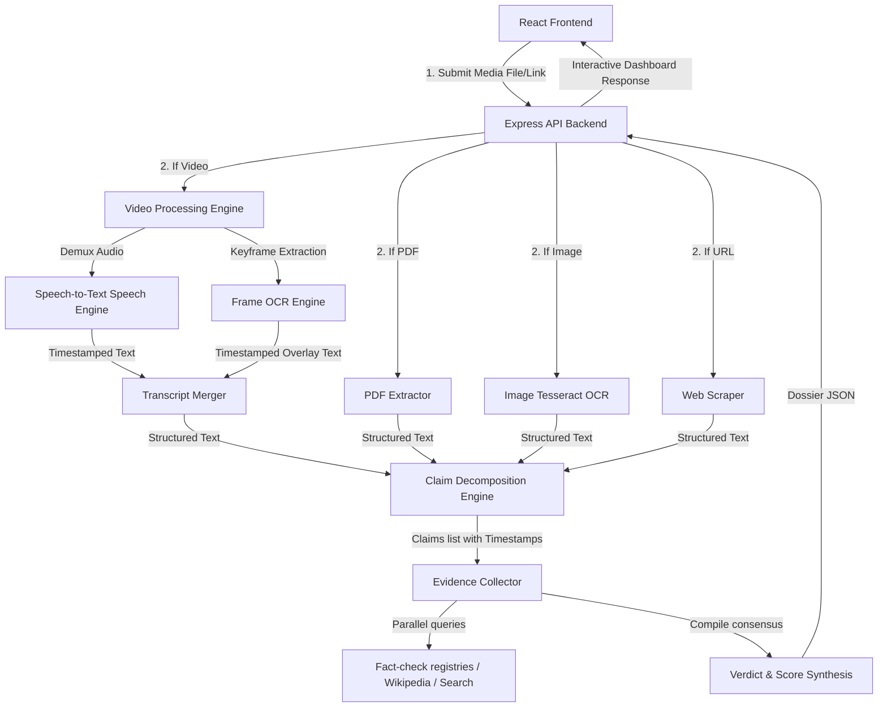

# System Architecture Document

## TruthLens-AI - Multimodal AI Claim Verification & Investigation Lab
*Tagline: Verify Any Claim. Trust Every Verdict.*

---

## 1. High-Level Architecture Overview

TruthLens-AI operates as a decoupled MERN platform upgraded to support a **Unified Multimodal Claim Verification Pipeline**. The system ingests Text, URLs, Screenshots, PDFs, and Video (YouTube, Reels, X, MP4) feeds, normalizes them into structured text, decomposes the text into claims, verifies each claim independently, and returns granular timeline records and interactive evidence graphs.

---

## 2. Component Layout & Modular Services

### 2.1 Video Processing Engine (`src/services/videoService.js`)
Handles multimedia conversion and transcript extraction:
1.  **Audio Demuxing**: Isolates sound files from video streams.
2.  **Speech-to-Text**: Formulates speech recognition tracks mapping spoken sentences to relative starting timestamps.
3.  **Frame Sampling & OCR**: Samples key video frames at 3-second intervals, executing frame OCR to capture subtitles or visual overlays.
4.  **Transcript Merger**: Combines audio transcripts and visual texts into a single synchronized structured script, preserving precise timestamps.

---

## 3. Evidence Intelligence System (STR & Deduplication)

### 3.1 Source Trust Registry (STR) Model
The schema `SourceRegistry` persists credibility logs for crawled domains.

### 3.2 Primary Source Detector (Deduplication)
Analyzes evidence snippets using regular expressions to flag syndicated wire content (e.g. *"according to Reuters"* or *"Associated Press reported"*). Aggregates republished entries under a single deduplication key.

### 3.3 Adjacency Relationship Graph Compiler (`graphGenerator.js`)
Compiles a node-link network map of the claims verification chain mapping claims, publishers, wire agencies, and verdicts.

### 3.4 Mathematical Confidence Calculations
Computes confidence percentage mathematically:
$$\text{Confidence} = C_{\text{Quantity}} \cdot 0.20 + C_{\text{Quality}} \cdot 0.35 + C_{\text{Agreement}} \cdot 0.25 + C_{\text{Diversity}} \cdot 0.20$$

---

## 4. Retrieval-Augmented Verification (RAV v3) Engine Architecture

### 4.1 Intelligent Claim Classification Engine (`claimUnderstander.js`)
*   Extracts semantic parameters from raw texts (subject, predicate, object, event, location, negation, intent).
*   Classifies claims into 19 supported categories (Death / Celebrity Death, Health / Medical, Government Announcement, Election / Politics, Crime, Disaster, Financial Scam, Investment, Sports, Entertainment, Science, Space, Education, Historical, Technology, Weather, Business, International Affairs, Social Media Rumor).

### 4.2 Entity Linking Engine (`entityLinker.js`)
*   Maps raw subject names to canonical real-world entities (e.g. "Amitabh" $\rightarrow$ "Amitabh Bachchan").
*   Checks for ambiguity: if link confidence is low ($<60\%$), it flags `requiresClarification: true` along with candidate suggestions.
*   HTTP 409 intercepts trigger a modal select panel on the frontend (`Analysis.jsx`) allowing users to choose the target entity.

### 4.3 Redesigned Multi-Provider Search Failover (`webSearcher.js`)
*   Implements a search provider queue: DuckDuckGo Lite (POST), DuckDuckGo HTML (GET), and Wikipedia Search API.
*   If a search provider is blocked, times out, or returns empty results, the engine automatically catches the error and failovers to the next provider in the queue, preventing search system unavailability.

### 4.4 Pre-Check Link Validation & Content Extraction (`evidenceCollector.js`)
*   **Reachability Check**: Before any candidate URL is processed, the system executes a rapid HEAD request (falling back to a GET request with a range limit `0-1024` if HEAD is blocked by CDNs) with a 4-second timeout. Unreachable, 404, or 500 links are discarded.
*   **cheerio Full-Page Scraping**: Retrieves full page HTML and strips boilerplate (navigation, ads, comments, cookie banners, related posts, footers).
*   **nlp Grounded Extraction**: Submits the clean page text to the AI task orchestrator to pull publisher, date, author, canonical URL, and evidence summaries without hallucination.

### 4.5 Duplicate & Syndication Detection (`evidenceCollector.js`)
*   Computes Jaccard word-set similarities between headlines and extracted article body text.
*   Republished wire copies (e.g. AP/Reuters syndications) matching existing articles with Jaccard similarity $> 0.65$ are marked as duplicates and discarded to prevent false consensus inflation.

### 4.6 8-Dimensional Source Quality Scorecard (`evidenceCollector.js`)
*   Every validated source is assigned scores across 8 dimensions:
    1.  *Reliability*: General publisher reputation rating.
    2.  *Original Reporting*: Verified primary reporting status vs syndicated republishing.
    3.  *Freshness*: Date-age penalty score.
    4.  *Transparency*: Sourced metadata completeness.
    5.  *Authority*: Domain credentials weighting (gov/edu vs news vs public encyclopedias).
    6.  *Entity Match*: Semantic subject alignment rating.
    7.  *Claim Match*: Factual statement alignment rating.
    8.  *Evidence Strength*: Solidity of extracted points.

### 4.7 Multi-Stage Confidence Engine (`confidenceCalculator.js`)
*   Replaces single overall scores with 5 component-level confidence values:
    1.  *Entity Confidence* (linking precision)
    2.  *Claim Confidence* (parse semantic clarity)
    3.  *Retrieval Confidence* (adapter query coverage)
    4.  *Evidence Confidence* (source reputation & relevance)
    5.  *Verdict Confidence* (degree of source consensus)
*   **Overall Confidence** is calculated as:
    $$\text{Overall} = \text{Entity} \cdot 0.15 + \text{Claim} \cdot 0.15 + \text{Retrieval} \cdot 0.20 + \text{Evidence} \cdot 0.25 + \text{Verdict} \cdot 0.25$$

### 4.8 TTL Cache (`evidenceCache.js`)
*   An in-memory TTL caching layer hashes inputs. Hit entries bypass new crawls and return the cached verification dossier directly (expire time: 2 hours).

### 4.9 RAG Context Grounding (`ragContextBuilder.js`)
*   Compiles structured facts block representing the **sole** allowed source of knowledge for the LLM.

---

## 5. AI Orchestration Layer Architecture

### 5.1 Model Swappability & Config Routing (`aiConfig.js`)
Defines setting parameters for provider priorities, connection timeouts, and exponential backoff retry values. Exposes `orchestrateAiTask(taskName, prompt, isJson)`.

### 5.2 Dynamic Failovers & Retries
If the primary provider throws a connection exception or times out, the orchestrator retries the call using exponential backoffs.

### 5.3 Memory Rate-Limiting Middleware (`rateLimitMiddleware.js`)
Protects backend computational resources. Enforces user tiers limits.

### 5.4 Health & Telemetry Endpoint (`healthRoutes.js`)
Provides checks for the database state, API keys configuration, and queries latency summaries.

---

## 6. Explainability Engine (XAI) Architecture

### 6.1 Explain-Like Style Api Endpoint
Exposes `/api/v1/analysis/:id/explain-like`. Ingests the `style` key (Child, Student, Researcher, Journalist, Developer) and executes a persona-grounded prompt against the AI Orchestration layer.

### 6.2 Courtroom Panels & Claim Folders
*   **Prosecution & Defense Boards**: Renders contradicting (fact-checks) versus corroborating (government/academic/trusted news) source snippets.
*   **Claim Dossiers**: Renders expandable case file cards displaying individual priority levels, source reliability index scores, and verification methods.
*   **Confidence Breakdown**: Visualizes the weighted percentage contributions of Quality, Reliability, Agreement, and Diversity metrics.
*   **Evidence Chain Flowchart**: Traces the 7 sequential backend processing steps from normalization to verdict.

---

## 7. QA Hardening & Graceful Failure Architecture

### 7.1 File Ingestion Whitelisting (`fileUpload.js`)
Strictly whitelists allowed extensions and MIME types:
*   `Images`: `.png`, `.jpg`, `.jpeg`, `.webp` (MIME: `image/*`)
*   `Documents`: `.pdf` (MIME: `application/pdf`)
*   `Videos`: `.mp4`, `.webm`, `.avi`, `.mov` (MIME: `video/*`)
*   Payload size threshold: Max `25MB`.

### 7.2 Graceful Exception Handlers (`analysisController.js`)
*   **PDF Parsing Errors**: Catches exceptions in `pdfService.js` (e.g. from corrupted or password-protected PDF files) and returns user recovery guides.
*   **OCR Scanning Errors**: Catches exceptions in `ocrService.js` (e.g. from blurred, low-resolution screenshots) and prompts the user to upload high-contrast captures.
*   **Video Transcription Errors**: Catches exceptions in `videoService.js` (e.g. from videos without speech tracks) and falls back to frame OCR timelines automatically.

### 7.3 Centralized Error Boundaries (`errorMiddleware.js`)
If `process.env.NODE_ENV === 'production'`, internal code exception stacks are automatically stripped and masked before returning JSON responses to clients, preventing callstack disclosure leaks.

---

## 8. Deployment & Installable PWA Architecture

### 8.1 Progressive Web App Registration (`manifest.json`)
*   Frontend assets directory `/public/manifest.json` defines orientation, start url (`.`), standalone mode, and icon sizes.
*   Linked inside `index.html` headers to support mobile and desktop installation.

### 8.2 Client-Side Route Rewrites (`vercel.json`)
Redirects all relative paths matching `/(.*)` back to the `/index.html` landing page, preventing Vercel static router 404 errors during client page refreshes.
