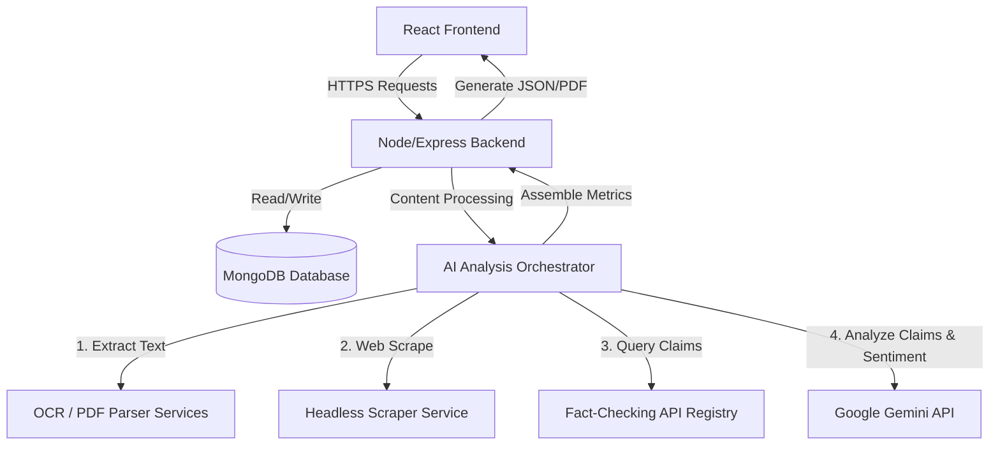
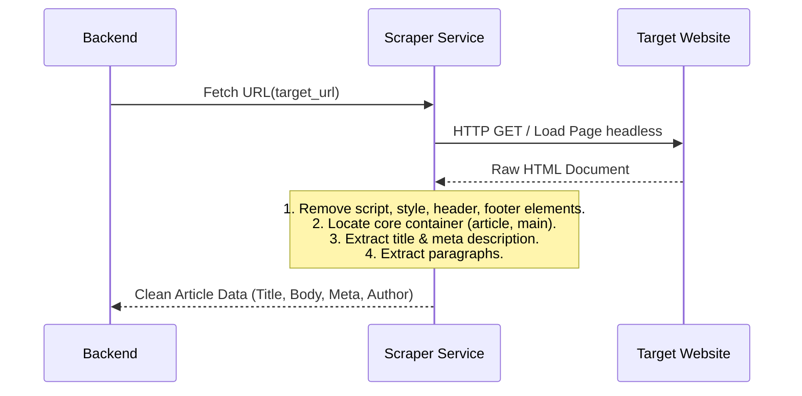

# System Architecture Document

## TruthLens AI
*Tagline: Think Before You Share.*

---

## 1. High-Level System Architecture

TruthLens AI follows a decoupled MERN stack architecture with a modular AI Analysis Orchestrator. The front end is a responsive, mobile-first single-page application (SPA), and the backend serves as a RESTful API gateway that interacts with an database cluster, scrapers, OCR engines, and AI services.



### 1.1 Core Components
1.  **Frontend SPA**: Built with React (Vite-powered) using CSS, Zustand for light state management, and Axios for HTTP requests.
2.  **API Backend Gateway**: Built with Node.js and Express. Handles routing, schema validation, rate-limiting, user accounts/sessions, and orchestration of the analysis workflow.
3.  **Database Cluster**: MongoDB instances holding user profile data, session histories, cached verification summaries, and flagged source whitelists/blacklists.
4.  **AI Analysis Orchestrator**: A specialized module within the backend that handles task parallelization (e.g., executing tone analysis, web scraping, and claims verification in parallel) and consolidates results into the unified **Trust Score**.

---

## 2. Frontend Architecture & Design

### 2.1 Technology Stack
*   **Framework**: React 18+ (using functional components and hooks).
*   **Build Tool**: Vite (for near-instant hot module replacement and optimized production builds).
*   **Styling**: Vanilla CSS with CSS Variables for theme consistency, HSL color tokens, and custom animations.
*   **State Management**: Zustand (lightweight, minimal boilerplate, ideal for simple session storage and modal states).
*   **Routing**: React Router DOM v6.
*   **HTTP Client**: Axios (configured with intercepts for token/session management).

### 2.2 Project Folder Structure (Frontend)

```
frontend/
├── public/
│   ├── favicon.ico
│   └── locales/                # Language assets (en.json, hi.json)
├── src/
│   ├── assets/                 # Icons, illustrations, custom fonts
│   ├── components/             # Reusable global components
│   │   ├── Common/             # Buttons, Inputs, Modals, Loaders
│   │   ├── Navigation/         # Navbar, Sidebar, Footer
│   │   ├── QuickCheck/         # Quick Check Input & Basic Trust Gauge
│   │   └── DeepAnalysis/       # Interactive Chat, Source Table, Metric Breakdown
│   ├── context/                # Theme and Language Provider contexts
│   ├── hooks/                  # Custom hooks (e.g., useAuth, useAnalysis)
│   ├── pages/                  # Route-level components
│   │   ├── Home.jsx            # Unified dashboard for Quick & Deep entries
│   │   ├── Results.jsx         # Detailed report visualization
│   │   ├── History.jsx         # Saved user analyses (authenticated)
│   │   ├── Profile.jsx         # User preferences and settings
│   │   └── Login.jsx           # Simple email/Google authentication
│   ├── services/               # API connection modules
│   │   ├── api.js              # Axios configuration and error handling
│   │   └── analysisService.js  # Endpoints for running analysis
│   ├── store/                  # Zustand store definitions
│   │   ├── authStore.js        # User state
│   │   └── analysisStore.js    # Current and cached analysis results
│   ├── styles/                 # Theme tokens and base styling
│   │   ├── variables.css       # HSL palette, fonts, spacing
│   │   ├── global.css          # Base resets and animations
│   │   └── components.css      # Shared element designs
│   ├── App.jsx
│   └── main.jsx
```

### 2.3 State Management Strategy
We use **Zustand** to manage two core slices of state:
1.  **Auth Slice**: Stores token payloads, active user profile details, and login statuses. Persists to `localStorage` automatically using Zustand middleware.
2.  **Analysis Slice**: Holds the current active analysis input, loading state indicators, error details, and final calculation outputs.

---

## 3. Backend Architecture & Design

### 3.1 Technology Stack
*   **Platform**: Node.js (LTS version).
*   **Framework**: Express.js.
*   **Database ODM**: Mongoose.
*   **OCR**: Tesseract.js (self-contained node-based engine) or Cloud Vision API wrapper.
*   **Scraper**: Puppeteer Core / Cheerio (for fast, lightweight page parsing).
*   **Security & Auth**: JSON Web Tokens (JWT), bcrypt for passwords, and Helmet for HTTP header protection.

### 3.2 Project Folder Structure (Backend)

```
backend/
├── src/
│   ├── config/                 # Database, Gemini, and general configs
│   │   ├── db.js
│   │   └── ai.js
│   ├── controllers/            # Request handlers
│   │   ├── authController.js
│   │   └── analysisController.js
│   ├── middleware/             # Express Middlewares
│   │   ├── authMiddleware.js   # JWT validation
│   │   ├── rateLimiter.js      # IP and API rate limiting
│   │   └── errorHandler.js     # Unified error conversion
│   ├── models/                 # Mongoose schemas
│   │   ├── User.js
│   │   └── Analysis.js
│   ├── services/               # Core business & AI logic
│   │   ├── orchestrator.js     # Analysis manager
│   │   ├── ocrService.js       # Text extraction from images
│   │   ├── scraperService.js   # Article parsing
│   │   ├── geminiService.js    # LLM integration wrapper
│   │   └── searchService.js    # Factcheck indexing queries
│   ├── utils/                  # Helper functions (PDF generators, math formulas)
│   │   ├── pdfGenerator.js
│   │   └── trustCalculator.js
│   ├── app.js                  # App instantiation
│   └── server.js               # Entry point
├── tests/                      # Integration and unit tests
└── package.json
```

---

## 4. AI & Data Processing Pipelines

### 4.1 URL Content Scraper Flow
When a user submits a URL, the system scrapes and cleans the content to feed it to the NLP models:



### 4.2 OCR & Screenshot Pipeline
For image uploads, the system extracts the text overlay before processing:
1.  **Image Receipt**: Backend receives the multipart file upload.
2.  **Preprocessing**: Grayscales and resizes the image to optimize character detection.
3.  **OCR Processing**: Runs Tesseract.js over the processed buffer.
4.  **Cleaning**: Removes artifact characters and aligns broken text rows into a single text block.

### 4.3 Detailed AI Processing Pipeline & Analysis Flow

```
   Clean Text Block (from OCR, Scraper, or Manual Input)
                         |
                         v
            [ Language & Tone Detection ]
                         |
       +-----------------+-----------------+
       | (Hindi/Hinglish)                  | (English)
       v                                   v
[ Translate to English ]        [ Direct NLP Processing ]
       |                                   |
       +-----------------+-----------------+
                         |
                         v
             [ Named Entity & Claim Extraction ]
                         |
       +-----------------+-----------------+
       |                                   |
       v                                   v
[ Sentiment & Emotion Analysis ]   [ Fact Check Search Query ]
(sensationalism, fear levels)      (Google Fact Check, whitelists)
       |                                   |
       +-----------------+-----------------+
                         |
                         v
             [ trustCalculator.js Calculation ]
                         |
                         v
             [ Gemini Synthesis of Narrative ]
```

---

## 5. Database Schema Design

We utilize MongoDB to store user configurations and analysis histories.

### 5.1 User Collection Schema (`users`)
```json
{
  "_id": "ObjectId",
  "name": "String",
  "email": { "type": "String", "unique": true, "required": true },
  "passwordHash": { "type": "String", "required": false }, // null for OAuth
  "provider": { "type": "String", "enum": ["local", "google"] },
  "preferences": {
    "language": { "type": "String", "default": "en" },
    "theme": { "type": "String", "default": "dark" }
  },
  "createdAt": "Date",
  "updatedAt": "Date"
}
```

### 5.2 Analysis Collection Schema (`analyses`)
```json
{
  "_id": "ObjectId",
  "userId": { "type": "ObjectId", "ref": "User", "required": false }, // null for guests
  "inputType": { "type": "String", "enum": ["text", "url", "image", "pdf"] },
  "rawInput": "String", // Stores text or extracted OCR text
  "sourceUrl": "String", // null if manual text or image
  "title": "String", // Extracted title or generated summary title
  "metrics": {
    "trustScore": { "type": "Number", "min": 0, "max": 100 },
    "sourceReputation": { "type": "Number", "min": 0, "max": 100 },
    "biasScore": { "type": "Number", "min": 0, "max": 100 },
    "claimVerification": { "type": "Number", "min": 0, "max": 100 },
    "emotionScore": { "type": "Number", "min": 0, "max": 100 }
  },
  "extractedClaims": [
    {
      "claim": "String",
      "verdict": "String",
      "checkedBy": "String", // Factcheck site name
      "url": "String" // Citation link
    }
  ],
  "sentimentAnalysis": {
    "dominantEmotion": "String",
    "sensationalismDetected": "Boolean",
    "explanation": "String"
  },
  "explainableNarrative": {
    "en": "String",
    "hi": "String"
  },
  "createdAt": "Date"
}
```

---

## 6. API Design Strategy

All routes are prefixed with `/api/v1`.

### 6.1 Authentication Endpoints
*   `POST /auth/register` - Creates a new user profile.
*   `POST /auth/login` - Authenticates credentials, returns JWT in httpOnly Cookie.
*   `POST /auth/oauth/google` - Verifies Google OAuth token, initiates session.
*   `POST /auth/logout` - Clears cookie session.

### 6.2 Analysis Endpoints
*   `POST /analysis/quick` - Receives text/URL. Performs fast lightweight evaluation. Returns immediate score and verdict.
*   `POST /analysis/deep` - Receives text/URL/image/PDF. Runs complete background pipeline (OCR, Scrape, FactCheck, LLM analysis). Returns structured response.
*   `GET /analysis/history` - Returns paginated analysis list for the logged-in user.
*   `GET /analysis/:id` - Retrieves a specific analysis entry.
*   `GET /analysis/:id/report` - Generates and returns a downloadable PDF report of the analysis.

---

## 7. Security & Scalability Plan

### 7.1 Security Architecture
*   **Secrets Storage**: All database URIs, API keys (Gemini, Google Factcheck), and JWT secrets reside in `.env` files and are loaded strictly into memory.
*   **CORS Configuration**: Restrict API access to trusted client origins only.
*   **CSRF & XSS Prevention**: Use `Helmet` to configure secure HTTP headers (Content Security Policy, X-Frame-Options). All input text is sanitized using `dompurify` on the client and `express-validator` on the server before database write or model ingestion.

### 7.2 Scalability & Caching
*   **Request Caching**: Store MD5 hashes of input text and URLs along with their analysis IDs in a Redis cache or in-memory MongoDB buffer. If the same content is checked within 12 hours, return the existing analysis results instead of querying the AI APIs.
*   **Rate Limiting**: Limit API requests to 15 per minute per IP address for standard analysis endpoints to prevent denial-of-service attempts.

---

## 8. Deployment Strategy

*   **Frontend**: Deployed to Vercel or Netlify (static build distribution) with route caching and CDN redirection.
*   **Backend Node.js API**: Deployed to Render, Railway, or AWS Elastic Beanstalk (horizontal container scaling).
*   **Database**: MongoDB Atlas cloud cluster configured with secondary replica nodes to ensure failover capability.
*   **Environment Variables Setup**:
    ```ini
    PORT=5000
    NODE_ENV=production
    MONGODB_URI=mongodb+srv://...
    JWT_SECRET=your_jwt_signing_key_here
    GEMINI_API_KEY=your_gemini_api_key
    FACTCHECK_API_KEY=your_google_fact_check_api_key
    ```

---

## 9. AI Intelligence Layer & Methodology

### 9.1 Hybrid Processing Pipeline
Rather than relying on a single large language model (LLM) answer, TruthLens AI uses a multi-stage hybrid fact-check architecture:
1.  **Extractors (cheerio / tesseract.js / pdf-parse)**: Reads and normalizes input text.
2.  **Structural Analyzer (Google Gemini API)**: Evaluates semantic elements (Language, entities, factual assertions, tone clickbait flags, loaded bias ratings) and outputs structural JSON.
3.  **Google Fact-Check tools cross-referencer**: Searches the indexed factcheck APIs using extracted claims.
4.  **Trust Score Engine**: Aggregates the metrics (Source, Bias, Claims, Emotions) using configured weights.
5.  **Explainable AI narrative generator**: Translates the results into plain paragraphs in both English and Hindi.

### 9.2 Configurable Weights Methodology
The Trust Score uses a customizable, weighted aggregation formula. If no custom weights are specified, the system utilizes:
*   `claimVerification`: 45% (Determined by Fact Check API search matches and claim assessments).
*   `sourceReputation`: 25% (Based on domain reputation metrics and whitelists).
*   `biasScore`: 20% (Presents objectivity level; loaded framing reduces score).
*   `emotionScore`: 10% (Flags clickbait markers and panic triggers).

### 9.3 Gemini Prompting Schema
To ensure type safety, the model parameter `responseMimeType: "application/json"` is specified, demanding:
```json
{
  "language": "string",
  "cleanedText": "string",
  "entities": {
    "people": ["string"],
    "organizations": ["string"],
    "locations": ["string"],
    "statistics": ["string"]
  },
  "claims": ["string"],
  "bias": {
    "score": "number",
    "framing": "string",
    "explanation": "string"
  },
  "emotions": {
    "score": "number",
    "triggers": ["string"],
    "explanation": "string"
  },
  "source": {
    "score": "number",
    "reputation": "string",
    "explanation": "string"
  }
}
```

### 9.4 Known Limitations
*   **Hinglish Normalization**: Informally written WhatsApp Hinglish can decrease claim matching quality. Gemini helps normalize Hinglish before executing searches, but spelling variations remain a factor.
*   **Screenshot Blur**: Low resolution or tilted text captures degrade Tesseract OCR efficiency. Preprocessing mitigates this but cannot reconstruct fully blurred images.
*   **Fact-check tools coverage**: The Google Fact Check Tools API is restricted to assertions verified by member organizations. If no matching check exists, the system flags the claim "Needs Verification" rather than making absolute claims.

---

## 10. Integration & Polished User Configurations

### 10.1 History & Bookmarking System
The log history supports two modes of operation:
*   **Guest Mode**: Search entries are cached inside client browser `localStorage`.
*   **Registered Mode**: Records are persisted in MongoDB linked to the User model. Bookmarks are tracked using a compound index mapping `userId` and `analysisId` in `Bookmark` collection, permitting fast, indexed listing of starred reports.

### 10.2 PDF Report Generation & Print Layouts
Rather than pulling bloated external PDF renderers, report exports leverage native browser printing styles:
*   **Print Stylesheets (`@media print`)**: Configured in `global.css` to hide headers, footers, interactive buttons, and AI drawers, while normalizing color schemes to high-contrast greyscale format.
*   **PDF Exports**: Tapping "Print / Export PDF" triggers `window.print()`, presenting the user with a pre-formatted print preview layout for direct download or local printing.

### 10.3 AI Context-Grounded Workspace
When a user launches the results dashboard, the frontend initializes a database-backed chat session. When follow-up prompts are submitted:
1.  The query is sent to `/api/v1/chat/sessions/:sessionId/messages`.
2.  The backend pulls the associated analysis metadata (claims, trust metrics, XAI narratives).
3.  The conversational agent grounds its response on this specific metadata, maintaining the conversation history.

### 10.4 Multilingual State Strategy
TruthLens AI is fully localized to support English and Hindi:
*   **Zustand Language State**: Tracks active language setting (`en` / `hi`) and persists it in `localStorage` and the database user profile.
*   **Static UI Translation**: Screen labels are mapped using dynamic template lookups depending on store's `language`.
*   **AI Synthesis Localization**: Gemini prompts synthesize and return explainable narratives in both languages simultaneously (`explainableNarrative.en` and `explainableNarrative.hi`), allowing instant toggles without triggering duplicate LLM calls.


