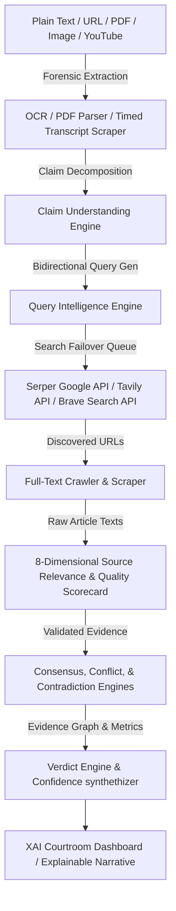

# VeriLens AI - Professional Fact Verification Platform

VeriLens AI is a production-grade, end-to-end evidence-driven fact verification platform designed to verify information from multi-modal inputs (Text, URLs, PDF Documents, Images, and YouTube Videos) using real-time search engine failover groups, web crawlers, and advanced natural language processing.

Unlike simple search-snippet summarizers, VeriLens AI crawls the live web, extracts full-text articles, validates source relevance, checks primary source syndication, and performs mathematical confidence calculations before delivering transparent verdicts and explainable narratives.

---

## 🛠️ Architecture



---

## 🚀 Features

*   **Multi-Modal Forensic Extraction**: Scans plain text, parses raw PDF text layers, runs Tesseract OCR on images/screenshots, and crawls YouTube player source to scrape timed video transcripts.
*   **Production-Grade Web Search Failover**: Cascades query execution across Serper (Google Search API) $\rightarrow$ Tavily Search API $\rightarrow$ Brave Search API $\rightarrow$ Scraped Bing $\rightarrow$ Yahoo $\rightarrow$ DuckDuckGo $\rightarrow$ Wikipedia API.
*   **Full-Text Article Crawler**: Visits discovered URLs, bypasses Cloudflare/CDN rate limits, strips boilerplate navigation/footers, and extracts clean, substantial body text.
*   **8-Dimensional Quality Scorecard**: Dynamically scores source reliability, original reporting, freshness, transparency, authority, entity match, claim match, and evidence strength.
*   **Bilingual Narrative & Verdicts**: Generates objective verdicts (Likely Genuine, Likely Misleading, Needs Verification) and detailed English/Hindi narratives.
*   **XAI Courtroom Dashboard**: Rich interactive visualization featuring dynamic trust gauges, interactive evidence link networks, conflict resolution meters, and a developer sandbox.

---

## 💻 Tech Stack

| Component | Technology | Description |
| :--- | :--- | :--- |
| **Frontend** | React (Vite), Zustand, CSS variables | Lightweight SPA, reactive state client |
| **Backend** | Node.js, Express, Nodemon | RESTful API dispatcher & orchestrator |
| **Database** | MongoDB Atlas, Mongoose | Schema validation and analysis caching |
| **NLP & LLM** | OpenRouter (Gemini 2.5 Flash / custom fallbacks) | Claim decomposition, consensus evaluations |
| **Forensics** | Tesseract.js, `pdf-parse`, timed YouTube scrapers | Image OCR, PDF layer parsing, transcript extraction |

---

## 🧠 AI & Verification Pipeline

1.  **Claim Understanding**: Categorizes claim types (Sports, Health, Politics, etc.) and determines factual checkability.
2.  **Entity Resolution**: Isolates key nouns, places, and events to check alignment.
3.  **Query Generation**: Generates positive, negative, and official verification queries.
4.  **Consensus and Conflict Engines**: Computes stance ratios, flags source contradictions, and adjusts trust weightings.
5.  **Confidence Synthesis**: Synthesizes confidence scores based on entity overlap, source reputation, and evidence consistency.

---

## 🌐 APIs Used

1.  **Google Serper API** (`https://google.serper.dev/search`): Primary Google Search results provider.
2.  **Tavily Search API** (`https://api.tavily.com/search`): Professional AI web search provider.
3.  **Brave Search API** (`https://api.search.brave.com/`): Alternative web search provider.
4.  **OpenRouter API** (`https://openrouter.ai/api/v1`): LLM dispatcher for claims classification and evaluation.

---

## 📂 Folder Structure

```
TruthLens-AI/
├── backend/
│   ├── src/
│   │   ├── config/             # DB and client setups
│   │   ├── controllers/        # REST controllers (analysis, chat)
│   │   ├── middleware/         # Rate limiting, central error boundaries
│   │   ├── models/             # Schema logs (Analysis, SourceRegistry)
│   │   ├── routes/             # REST route registration
│   │   ├── services/
│   │   │   └── evidenceEngine/ # Core validation engine, consensus adapters
│   │   │   └── geminiService.js# LLM orchestration and NLP fallbacks
│   │   │   └── videoService.js # timed transcript scrapers
│   │   └── server.js           # API entry point
│   ├── .env.example
│   └── package.json
└── frontend/
    ├── src/
    │   ├── components/         # Shared views (Navbar, Footer, TrustGauge)
    │   ├── pages/              # SPA views (Home, Analysis, Results, History)
    │   ├── store/              # Zustand global state (analysisStore)
    │   └── main.jsx            # client entry
    ├── vite.config.js
    └── package.json
```

---

## ⚙️ Installation & Running Locally

### 1. Prerequisites
*   Node.js (v18 or higher)
*   MongoDB (local instance or MongoDB Atlas)

### 2. Environment Variables
Create a `.env` file in the `backend/` directory:
```env
PORT=5000
MONGODB_URI=mongodb://localhost:27017/truthlens
NODE_ENV=development

# LLM Orchestrator
OPENROUTER_API_KEY=your_openrouter_api_key_here

# Production Search Providers (Get keys from respective portals)
SERPER_API_KEY=your_serper_api_key_here
TAVILY_API_KEY=your_tavily_api_key_here
BRAVE_SEARCH_API_KEY=your_brave_search_api_key_here
```

### 3. Install Dependencies
```bash
# Backend dependencies
cd backend
npm install

# Frontend dependencies
cd ../frontend
npm install
```

### 4. Run Application
```bash
# Start backend (from backend/)
npm run dev

# Start frontend (from frontend/)
npm run dev
```

---

## 🔒 Security & Performance Optimizations

*   **JWT & Rate Limiting**: Centralized Express rate limiters protect the API endpoints from crawler spam.
*   **Security Headers**: Integrated `helmet` and `cors` to defend against XSS, injection, and unauthorized frame inclusions.
*   **Search Caching**: Implemented index-based caching of search and fact-check results to optimize query budgets.
*   **Scraper Boilerplate Filtering**: Removes scripts, styles, header tags, navigation structures, and ads before passing text payloads to evaluation pipelines, minimizing LLM input token usage.

---

## 🛠️ Developer Sandbox

The frontend includes a **Developer Sandbox** (`/developer`) allowing engineers to:
*   Inject raw mock data to test edge-case verdicts.
*   Inspect exact JSON response models returned by the evidence validator.
*   Tune reliability threshold boundaries and view real-time confidenceSynthesizer changes.

---

## 📝 FAQ & Troubleshooting

#### Q: The analysis is returning mock responses.
*   **A**: If your OpenRouter credentials are empty or out of credits, the system triggers local rule-based NLP fallbacks to keep processing claims. Verify your `OPENROUTER_API_KEY` status.

#### Q: How does YouTube transcript scraping work without the YouTube API?
*   **A**: It downloads the video's initial player HTML source, extracts the `ytInitialPlayerResponse` JSON object, and fetches the timed transcript segments directly using page crawlers.

---

## 📄 License
This project is licensed under the MIT License. See `LICENSE` for details.
